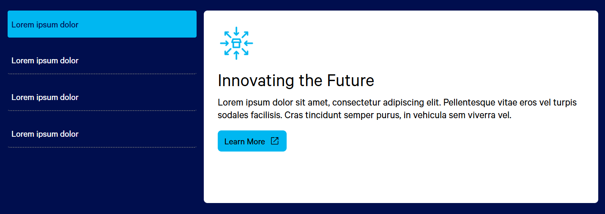

# 3.4 LP Template Updates

## 📘Overview

In alignment with our **new brand guidelines**, we’ve updated the Marketo landing page templates to better reflect the refreshed design and branding. This document outlines all the enhancements and components introduced in the **3.4 MKTO Landing Page Template**. Please review the changes to ensure you're building pages with the latest specifications.

---

## ✨Major Changes

- [Updated Font to "Calibri, sans-serif"](#font-family-change)
- [New Section Background Classes](#new-section-background-classes)
- [New Button Styles](#new-button-styles)
- [New UI Components](#new-ui-components)
<!-- - [Fallback Background Classes](#fallback-background-classes) -->
 
---

## 🔤Font Family Change

We’ve integrated a new typography stylesheet that manages:

- Font sizes  
- Font weights  
- Overall font styling  

The global font family is now set to **"Calibri, sans-serif"**, and all LPs built with the 3.4 template will automatically inherit this style.

---

## 🎨New Section Background Classes

To improve visual consistency, the following **section background classes** have been added:

- `section-bg-primary`  
- `section-bg-secondary`  
- `section-bg-white`  
- `section-bg-grey`  
- `section-bg-darkblue`  

These classes automatically adjust the **text color** based on the background.

<!-- ---

## 📱Fallback Background Classes

**Fallback BG classes** are intended for mobile optimization when background images do not scale well or affect text visibility. When applied, they:

- **Hide the background image** on mobile
- Replace it with a solid background color for **better readability**

Available fallback classes:

- `section-bg-primary`  
- `section-bg-secondary`  
- `section-bg-white`  
- `section-bg-grey`  

--- -->

## 🔘New Button Styles

We’ve added a variety of **button styles**. Apply any of the following classes to an anchor (`<a>`) tag to style them as buttons:


### Primary Button Classes

- `primary-button`
- `secondary-button`
- `button-darkblue`
- `button-clear`
- `button-clear-black`

### Text Link Styles

- `text-link`
- `text-link-white`
- `text-link-black`

### Icon Add-ons (Optional)

To include icons within buttons, use these additional classes:

- `new-window`
- `right-arrow`
- `video-play`
- `download`
- `chat-later`
- `chat-now`
- `contact-us`

---

## 🧩New UI Components

We’ve introduced the following components to match the main website's UI. Each includes **boilerplate code**—simply copy and edit the content as needed.

### 📄Archer Card Assets

A card layout with an icon, title, and description.


```html
<ul class="archer archer-column-3 archer-card-assets">
    <li>
        
        <h3>Asset Title</h3>
        <p>Description</p> 
    </li>
    <li>
        
        <h3>Asset Title</h3>
        <p>Description</p> 
    </li>
    <li>
        
        <h3>Asset Title</h3>
        <p>Description</p> 
    </li>
</ul>
````


### 📚Archer Column Assets

Ideal for showcasing resource assets in a structured column layout. Do not modify or add additional styles to this predefined layout.


```html
<ul class="archer archer-column-3 archer-column-assets">
    <li>
        
        <span>Asset Label</span>
        <h3>Asset Title</h3>
        <p>Description</p>
        <a href="asset-link" target="_blank">Learn More</a>
    </li>
    <li>
        
        <span>Asset Label</span>
        <h3>Asset Title</h3>
        <p>Description</p>
        <a href="asset-link" target="_blank">Learn More</a>
    </li>
    <li>
        
        <span>Asset Label</span>
        <h3>Asset Title</h3>
        <p>Description</p>
        <a href="asset-link" target="_blank">Learn More</a>
    </li>
</ul>
````

### 🎞️Asset Slider 1

A version of Archer Column Assets that includes navigation arrows.
Displays 3 assets at a time, allowing navigation to additional items.


```html
<ul class="archer-asset-slider">
    <li>
        
        <span>Asset Label</span>
        <h3>Asset Title</h3>
        <p>Description</p>
        <a href="asset-link" target="_blank">Learn More</a>
    </li>
    <li>
        
        <span>Asset Label</span>
        <h3>Asset Title</h3>
        <p>Description</p>
        <a href="asset-link" target="_blank">Learn More</a>
    </li>
    <li>
        
        <span>Asset Label</span>
        <h3>Asset Title</h3>
        <p>Description</p>
        <a href="asset-link" target="_blank">Learn More</a>
    </li>                        
</ul>
````

### 🖼️Asset Slider 2

A simplified slider version of Asset Slider 1 without images.


```html
<ul class="archer-asset-slider">
    <li>
        <span>Asset Label</span>
        <h3>Asset Title</h3>
        <p>Description</p>
        <a href="asset-link">Learn More</a>
    </li>
    <li>
        <span>Asset Label</span>
        <h3>Asset Title</h3>
        <p>Description</p>
        <a href="asset-link">Learn More</a>
    </li>
    <li>
        <span>Asset Label</span>
        <h3>Asset Title</h3>
        <p>Description</p>
        <a href="asset-link">Learn More</a>
    </li>
</ul>
````

### 🧭Horizontal Tabs

Modern replacement for the old Archer Asset Tabs. Supports up to 6 tabs (more possible, but not recommended). Navigation arrows will appear based on the number of tabs and CTA text.


```html
<ul class="archer-horizontal-tabs"> 
    <!-- First tab -->
    <li>
        <!-- button -->
        <a>CTA Text</a>
        <!-- Tab Content div. Content shoud be placed inside the below div-->
        <div> 
            <ul class="archer archer-column-2 align-items-center">
                <li>
                    
                    <h3>Heading</h3>
                    <p>Description</p>
                    <a href="asset-link" class="primary-button right-arrow">Learn More</a>
                </li>
                <li>
                    
                </li>
            </ul>
        </div>
    </li>
    <!-- Second tab --> 
    <li>
        <!-- button -->
        <a>CTA Text</a>
        <!-- Tab Content div. Content shoud be placed inside the below div-->
        <div> 
            <ul class="archer archer-column-2 align-items-center">
                <li>
                    
                    <h3>Heading</h3>
                    <p>Description</p>
                    <a href="asset-link" class="primary-button right-arrow">Learn More</a>
                </li>
                <li>
                    
                </li>
            </ul>
        </div>
    </li>
</ul>
````

### 📐Vertical Tabs

Functions like Horizontal Tabs but displays vertical CTA buttons.



```html
<ul class="archer-vertical-tabs">
    <!-- First tab --> 
    <li>
        <!-- button -->
        <a href="">CTA Text</a>
        <!-- Tab Content div. Content shoud be placed inside the below div-->
        <div>
            
            <h3>Heading</h3>
            <p>Description</p>
            <a href="asset-link" class="primary-button new-window">Learn More</a>
        </div>
    </li>
    <!-- Second tab --> 
    <li>
        <!-- button -->
        <a href="">CTA Text</a>
        <!-- Tab Content div. Content shoud be placed inside the below div-->
        <div>
            
            <h3>Heading</h3>
            <p>Description</p>
            <a href="asset-link" class="primary-button new-window">Learn More</a>
        </div>
    </li> 
</ul>
````

### 📝Case Study Slider

Ideal for showcasing case studies, this component includes: 
- Background image
- Logo
- Heading & description    
-  CTA button


```html
<ul class="archer-cs-slider">
    <!-- First CS tab -->
    <li data-bg="bg-img-path">
        
        <!-- Content Div -->
        <div>
            <h3>Heading</h3>
            <p>Description</p>
            <a href="#" class="primary-button right-arrow">Learn More</a>
        </div>
    </li> 
    <!-- Second CS tab -->
    <li data-bg="bg-img-path">
        
        <!-- Content Div -->
        <div>
            <h3>Heading</h3>
            <p>Description</p>
            <a href="#" class="primary-button right-arrow">Learn More</a>
        </div>
    </li> 
</ul>
````

### 🏷️Background Classes for UI Components

The following background utility classes can be applied to any component, except the Case Study Slider:

- `primary-bg`
- `secondary-bg`
- `grey-bg`

```html
<!-- Example -->
<ul class="archer-asset-slider primary-bg">
<li></li>
<li></li>
</ul>    

````

⚠️ Note: Avoid adding extra elements to these components. Use only the elements included in the boilerplate code to maintain the intended layout. However, you may safely remove any element you don’t need.

🔖 *Please save this document for future reference, as it will be regularly updated with new UI modules.*

